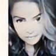

# UGATIT-PyTorch

### Overview

This repository contains an op-for-op PyTorch reimplementation of [U-GAT-IT: Unsupervised Generative Attentional Networks with Adaptive Layer-Instance Normalization for Image-to-Image Translation
](http://arxiv.org/abs/1907.10830).

### Table of contents

1. [About U-GAT-IT](#about-u-gat-it)
2. [Model Description](#model-description)
3. [Installation](#installation)
   * [Clone and install requirements](#clone-and-install-requirements)
   * [Download pretrained weights](#download-pretrained-weights)
   * [Download dataset](#download-dataset)
4. [Test](#test-eg-selfie2anime)
5. [Train](#train)
   * [Example](#example-eg-selfie2anime)
   * [Resume training](#resume-training-eg-epoch-100)
6. [Contributing](#contributing) 
7. [Credit](#credit)

### About U-GAT-IT

If you're new to U-GAT-IT, here's an abstract straight from the paper:

We propose a novel method for unsupervised image-to-image translation, which incorporates a new attention module 
and a new learnable normalization function in an end-to-end manner. The attention module guides our model to focus 
on more important regions distinguishing between source and target domains based on the attention map obtained 
by the auxiliary classifier. Unlike previous attention-based methods which cannot handle the geometric changes 
between domains, our model can translate both images requiring holistic changes and images requiring large shape 
changes. Moreover, our new AdaLIN (Adaptive Layer-Instance Normalization) function helps our attention-guided 
model to flexibly control the amount of change in shape and texture by learned parameters depending on datasets. 
Experimental results show the superiority of the proposed method compared to the existing state-of-the-art 
models with a fixed network architecture and hyper-parameters.

### Model Description

We have two networks, G (Generator) and D (Discriminator).The Generator is a network for generating images. 
It receives a random noise z and generates images from this noise, which is called G(z).Discriminator 
is a discriminant network that discriminates whether an image is real. The input is x, x is a picture, 
and the output is D of x is the probability that x is a real picture, and if it's 1, it's 100% real, 
and if it's 0, it's not real.

### Installation

#### Clone and install requirements

```bash
$ git clone https://github.com/Lornatang/UGATIT-PyTorch
$ cd UGATIT-PyTorch/
$ pip3 install -r requirements.txt
```

#### Download pretrained weights

```bash
# At present, I only provide the pre training model with image size equal to 96.
$ cd weights/
$ bash download_weights.sh
```

#### Download dataset

```bash
$ cd data/
$ bash get_dataset.sh
```

国内用户可以访问---> 网址：[百度云](https://pan.baidu.com/s/10PPBCyU2Yx0444i9k1ENmw) 密码: `yk31`

### Test (e.g selfie2anime)

The following commands can be used to test the whole test.

```bash
$ python3 test.py --dataset selfie2anime --image-size 96 --cuda
```

For single image processing, use the following command.

```bash
$ python3 test_image.py --file assets/testA_2.jpg --model-name selfie2anime --image-size 96 --cuda
```

Selfie to Anime





### Train

```text
usage: train.py [-h] [--dataroot DATAROOT] [--dataset DATASET] [--epochs N]
                [--image-size IMAGE_SIZE] [--decay_epochs DECAY_EPOCHS] [-b N]
                [--lr LR] [-p N] [--cuda] [--netG_A2B NETG_A2B]
                [--netG_B2A NETG_B2A] [--netD_A NETD_A] [--netD_B NETD_B]
                [--netL_A NETL_A] [--netL_B NETL_B] [--outf OUTF]
                [--manualSeed MANUALSEED]

PyTorch Generate Realistic Animation Face.

optional arguments:
  -h, --help            show this help message and exit
  --dataroot DATAROOT   Path to datasets. (default:`./data`)
  --dataset DATASET     dataset name. (default:`selfie2anime`)Option:
                        [apple2orange, summer2winter_yosemite, horse2zebra,
                        monet2photo, cezanne2photo, ukiyoe2photo,
                        vangogh2photo, selfie2anime]
  --epochs N            number of total epochs to run. (default:200)
  --image-size IMAGE_SIZE
                        Size of the data crop (squared assumed). (default:256)
  --decay_epochs DECAY_EPOCHS
                        epoch to start linearly decaying the learning rate to
                        0. (default:100)
  -b N, --batch-size N  mini-batch size (default: 1), this is the total batch
                        size of all GPUs on the current node when using Data
                        Parallel or Distributed Data Parallel.
  --lr LR               Learning rate. (default:0.0002)
  -p N, --print-freq N  Print frequency. (default:100)
  --cuda                Enables cuda
  --netG_A2B NETG_A2B   path to netG_A2B (to continue training)
  --netG_B2A NETG_B2A   path to netG_B2A (to continue training)
  --netD_A NETD_A       path to netD_A (to continue training)
  --netD_B NETD_B       path to netD_B (to continue training)
  --netL_A NETL_A       path to netL_A (to continue training)
  --netL_B NETL_B       path to netL_B (to continue training)
  --outf OUTF           folder to output images. (default:`./outputs`).
  --manualSeed MANUALSEED
                        Seed for initializing training. (default:none)
```

#### Example (e.g selfie2anime)

```bash
$ python3 train.py --dataset selfie2anime --image-size 96 --cuda
```

#### Resume training (e.g epoch 100)

If you want to load weights that you've trained before, run the following command.

```bash
$ python3 train.py --dataset selfie2anime --image-size 96 \
    --netG_A2B weights/selfie2anime/netG_A2B_epoch_100.pth \
    --netG_B2A weights/selfie2anime/netG_B2A_epoch_100.pth \
    --netD_A weights/selfie2anime/netD_A_epoch_100.pth \
    --netD_B weights/selfie2anime/netD_B_epoch_100.pth \
    --netL_A weights/selfie2anime/netL_A_epoch_100.pth \
    --netL_B weights/selfie2anime/netL_B_epoch_100.pth --cuda
```

### Contributing

If you find a bug, create a GitHub issue, or even better, submit a pull request. Similarly, if you have questions, simply post them as GitHub issues.   

I look forward to seeing what the community does with these models! 

### Credit

#### U-GAT-IT: Unsupervised Generative Attentional Networks with Adaptive Layer-Instance Normalization for Image-to-Image Translation

_Junho Kim, Minjae Kim, Hyeonwoo Kang, Kwanghee Lee_ <br>

**Abstract** <br>
We propose a novel method for unsupervised image-to-image translation, which incorporates a new attention module 
and a new learnable normalization function in an end-to-end manner. The attention module guides our model to focus 
on more important regions distinguishing between source and target domains based on the attention map obtained 
by the auxiliary classifier. Unlike previous attention-based methods which cannot handle the geometric changes 
between domains, our model can translate both images requiring holistic changes and images requiring large shape 
changes. Moreover, our new AdaLIN (Adaptive Layer-Instance Normalization) function helps our attention-guided 
model to flexibly control the amount of change in shape and texture by learned parameters depending on datasets. 
Experimental results show the superiority of the proposed method compared to the existing state-of-the-art 
models with a fixed network architecture and hyper-parameters.

[[Paper]](https://arxiv.org/pdf/1907.10830) [[Authors' Implementation (TensorFlow)]](https://github.com/taki0112/UGATIT) [[Authors' Implementation (PyTorch)]](https://github.com/znxlwm/UGATIT-pytorch) 

```
@inproceedings{
    Kim2020U-GAT-IT:,
    title={U-GAT-IT: Unsupervised Generative Attentional Networks with Adaptive Layer-Instance Normalization for Image-to-Image Translation},
    author={Junho Kim and Minjae Kim and Hyeonwoo Kang and Kwang Hee Lee},
    booktitle={International Conference on Learning Representations},
    year={2020},
    url={https://openreview.net/forum?id=BJlZ5ySKPH}
}
```